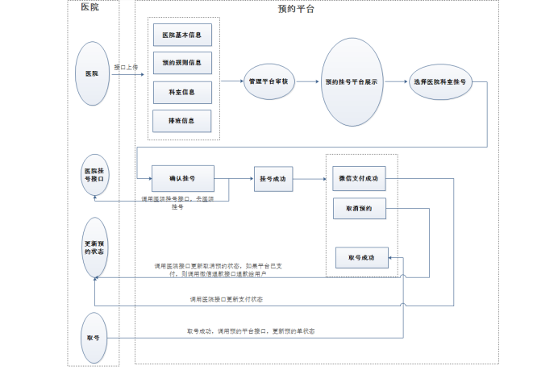
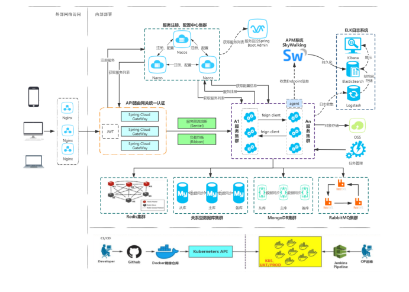

# mma-microservice

## 技術棧：
### 後端
### SpringBoot
### SpringCloud
### MyBatis-Plus：持久層框架
### Redis：內存緩存
### RabbitMQ：消息中間件
### HTTPClient: Http協議客戶端
### Swagger2：Api接口文檔工具
### Nginx：負載均衡 （前期使用nginx，後期使用spring-gateway網管替代）
### Mysql：關系型數據庫 5.7版本
### MongoDB：面向文檔的NoSQL數據庫
### Docker	：容器技術
### Git：代碼管理工具

### 前端
### 前端醫院後台管理系統和尚醫通統一掛號平台
### Vue+nuxt：vue-cli 腳手架
### Node.js： JavaScript 運行環境
### Axios：Axios 是一個基於 promise 的 HTTP 庫
### NPM：包管理器
### 前端有兩個，一個是醫院後台管理系統，另一個是尚醫通統一掛號平台

## 業務流程

## 服務架構

